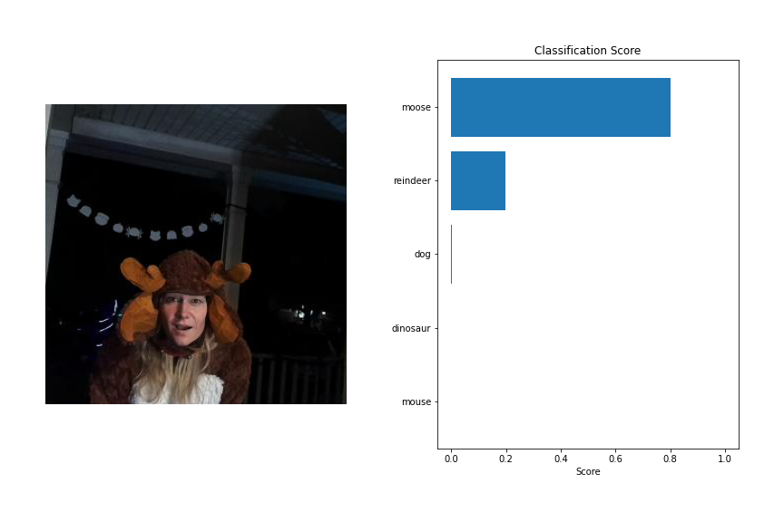

## Halloween 2022 Creepy Face:  Follows You and Guesses Your Costume

**Link to Youtube video:**  <https://www.youtube.com/watch?v=4xLwqETWKOY>

-----

This repo contains all the code used to run the creepy face from that video.  It is based on a sample script for person detection with depth estimation, in the [Luxonis DepthAI-Python Repository](https://github.com/luxonis/depthai-python/tree/main/examples/SpatialDetection).

The key features are:

+ Mostly unaltered person detection from Luxonis repo, using Mobilenet for person detection, with stereo depth for determining the closest person and their distance.
+ Added a separate thread to do all the management of servos, eye brightness, and responding to the pressure plate activity for the costume-ID sequence
+ It tries to keep the (approx) eye location of the closest person within the center of the image by pulsing the servos to move the face/camera towards the detection.
+ For costume ID it saves the most recent image from the camera, base64-encodes it, and sends it to a REST server on the local network.
* The costume ID server is running CLIP, which is an [extremely powerful zero-shot classifier from OpenAI](https://openai.com/blog/clip/).  It reads the list of costumes from costumes.txt, and computes embeddings for each one plugged into this statement: "A kid wearing a **X** costume".
* When a costume request is received, it encodes the image, and finds the closest text embedding.  That is the returned costume.
* It also generates some cool output to show you the top 5 results.

